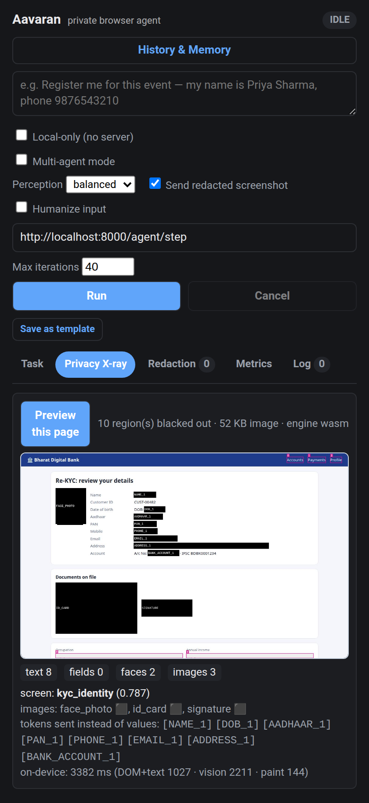

# Aavaran — on-device visual perception for a private browser agent

**SIH 2026 · PS 26171 · ISRO / Department of Space — "On-device Visual Perception for
Light-weight Browser Agents"**

Aavaran (आवरण, *veil*) lets a cloud or server LLM operate your browser without ever
seeing you. Everything on screen is perceived **in the browser** by three small models
(face detector, vision transformer, PII NER, ~52 MB total, WebGPU/WASM). Personal data is
replaced by consistent tokens in the text and **black-boxed at pixel level** in the
screenshot before any request is made. The server's open-weights VLM reasons over
`[NAME_1]`, `[AADHAAR_1]`, `FACE` and numbered UI marks, and can even *type your details
into a form* (`type n_0003 ← [EMAIL_1]`) because the real value is substituted only on
your device.



## Scorecard (measured — `eval/results/SUMMARY.md`)

| SIH criterion | Result |
|---|---|
| 1 · Visual context accuracy | **73.3%** screen category on **unseen websites** (217 screens, 96 sites, leave-domain-out; pixels-only zero-shot: 55.8%) |
| 2 · PII recall / precision | Indian PII **0.956 / 0.985** (F1 0.97) · public ai4privacy 0.751 / 0.991 · faces (WIDER) 0.78 / 0.73 |
| 3 · Redaction precision | **0.913** pixel precision, 0.997 pixel recall, **46/46** sensitive objects covered |
| 4 · Client resources | engine memory **37 MB** (eco) / **173 MB** (balanced) incl. WASM + weights · 52 MB models |
| 5 · End-to-end latency | on-device perception **~0.35 s**/step (median) · 5 demo tasks in 5.8–21.8 s, all passed |
| Privacy | server audit log searched for every raw user value after each task: **0 leaks** |

*(4-core i5-4310U laptop CPU, no GPU → WASM; WebGPU machines are faster.)*

## What makes it different

* **DOM-grounded pixel redaction.** Text PII is found in the DOM (checksum-validated
  Indian identifiers + on-device NER), then mapped to exact screen rectangles with
  `Range.getClientRects()`, so no OCR guessing is involved. Faces, ID cards, signatures and
  QR codes inside images are caught by YuNet + MobileCLIP, fused with DOM semantics
  (alt/aria/file names).
* **Reversible, consistent pseudonyms (the Vault).** The same person is `[NAME_1]`
  everywhere, in the task, on every page and in the screenshot label. The server keeps
  full reasoning ability, can act with your data, and answers "your OTP is `[OTP_1]`"; you
  see the real number.
* **Pixels × structure.** A ViT that never saw UIs, fused with structural DOM counts,
  jumps from 56% to 73% screen accuracy on sites it has never seen.
* **Adaptive compute.** Shared engine for all tabs, dHash frame cache, ROI mosaic (all
  avatars in one 640² face pass), per-page screen cache, eco/balanced/max modes, models
  warmed while you type.
* **Fail-closed in three places.** A client egress gate checks every outgoing string, the
  server re-checks and repairs, and an audit log proves what arrived. A screenshot is
  never sent if the visible tab isn't the scanned tab.
* **Indian context first.** Aadhaar (Verhoeff), masked Aadhaar, PAN, GSTIN (mod-36), UPI
  VPAs, IFSC-context account numbers, Indian mobiles, PIN-code addresses, DL, EPIC,
  passport, OTP SMS/email patterns.
* **Open-weights server.** Any OpenAI-compatible endpoint: Qwen2.5-VL, Llama-4-Scout or
  Gemma-3 on vLLM / Ollama / LM Studio, or a cloud host during the finale.

Architecture and design rationale: [`docs/ARCHITECTURE.md`](docs/ARCHITECTURE.md) ·
models: [`docs/model-contract.md`](docs/model-contract.md) · API:
[`docs/api-contract.md`](docs/api-contract.md) · evaluation: [`eval/README.md`](eval/README.md).

## Quick start

```bash
# 1. extension
npm install
npm run fetch-models          # ~52 MB, one time
npm run build                 # -> dist/          (Chrome, Edge, Brave)
npm run build:firefox         # -> dist-firefox/  (Firefox 128+)

# 2. server
python3 -m venv .venv && . .venv/bin/activate && pip install -r requirements.txt
cp .env.example .env          # pick a provider (below)
uvicorn server.app:app --port 8000
```

Load the extension: `chrome://extensions` → Developer mode → **Load unpacked** → `dist/`
(Firefox: `about:debugging` → Load Temporary Add-on → `dist-firefox/manifest.json`, then
allow site access in `about:addons`). Open <http://localhost:8000/demo/>, click the Aavaran
icon, and pick one of the demo tasks. The **Privacy X-ray** tab shows the exact frame and
tokens the server would receive, computed on-device without any network call.

### Server model (`.env`)

| `LLM_PROVIDER` | Settings | Notes |
|---|---|---|
| `vlm` (recommended) | `VLM_BASE_URL`, `VLM_MODEL`, `VLM_API_KEY` | Open weights, sees the redacted screenshot. e.g. Ollama `http://localhost:11434/v1` + `qwen2.5vl:7b`; vLLM `Qwen/Qwen2.5-VL-7B-Instruct`; or OpenRouter/Groq-hosted Llama-4-Scout |
| `inception` | `INCEPTION_API_KEY` | Mercury 2 (text-only, fast); used for the measured runs |
| `anthropic` | `ANTHROPIC_API_KEY` | optional |
| `mock` | — | offline stepper for plumbing tests |

`GET /health` shows the provider; `AUDIT_LOG=1` records every request the server receives
(`server/audit/requests.jsonl`; `GET /agent/last-received`).

## Demo sites (synthetic data only)

`server/demo/` holds a bank KYC page, webmail, a social feed, a checkout page and an ISRO
outreach registration form. All people are AI-generated faces; the ID card is marked
SPECIMEN. Every PII element carries ground-truth `data-pii` labels, which the eval uses and
the extension never reads.

## Evaluation

```bash
npm test                      # unit tests (PII engine, input simulation)
npm run eval:pii && npm run eval:faces && npm run eval:redaction
npm run eval:screens && npm run eval:latency && npm run eval:e2e
npm run eval:summary          # -> eval/results/SUMMARY.md
```

## Layout

```
extension/            MV3 extension (Chrome + Firefox builds from one source)
  lib/perception/     engine, YuNet, MobileCLIP, BERT-NER, WordPiece, image ops
  lib/                pixelPii, redact (rules + Vault), screenFeatures, privacyPipeline, …
  offscreen.*         Chrome host for the engine (Firefox runs it in the background page)
server/               FastAPI: /agent/step (+ plan, synthesize), leak re-check, demo sites
eval/                 reproducible metrics for all five criteria + results/
scripts/              model download, CLIP prompt embedding
docs/                 architecture, model + API contracts, PRD, plan
```

Optional multi-window "Comet mode" (parallel sub-agents) is documented in
[`docs/COMET_MODE.md`](docs/COMET_MODE.md); it is off by default because it multiplies
client compute.
