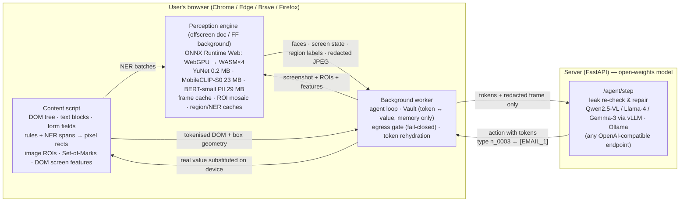

# Aavaran — architecture

**Aavaran** (आवरण, "veil"): an on-device privacy veil that sits between everything on
your screen and the cloud model that acts on it. The agent sees *structure*; only the
device ever sees *you*.

## One agent step

1. **Tokenise the task first.** The user's own values in the prompt ("my phone is
   9876543210") go into the Vault before anything is perceived, so they are
   recognised and hidden wherever they later appear on screen.
2. **DOM + text PII (content script).** Visible text is grouped per block element and
   scanned by checksum-validated rules (Aadhaar/Verhoeff, GSTIN mod-36, PAN, Luhn cards,
   UPI, IFSC-context accounts, OTPs, secrets…) and BERT-small NER (names, places), plus
   every value already in the Vault. Each span becomes exact rectangles via
   `Range.getClientRects()`. Sensitive fields (password/card/CVV/OTP/Aadhaar…) are
   boxed whole and their values never serialised.
3. **Capture.** `captureVisibleTab` immediately after the scan; if the page scrolled in
   between, re-scan. If the scanned tab is not the visible tab, **no image is sent**.
4. **Vision (engine).** dHash frame cache → YuNet on a mosaic of all image ROIs →
   one batched MobileCLIP run for the screen (once per page) + uncached regions →
   screen state fused with DOM structure; regions flagged sensitive by vision or DOM
   semantics.
5. **Redact.** Opaque boxes (never blur — blur is partly invertible), each labelled with
   the same token as the text layer; magenta Set-of-Marks on interactive elements;
   downscaled JPEG. Raw frame is dropped.
6. **Egress gate.** Every outgoing string is checked against the Vault's raw values and
   the high-confidence rules; anything left is tokenised and the fix is logged.
7. **Server.** Re-checks, reasons over tokens + redacted frame, returns one action.
8. **Act.** Tokens in the action are replaced with real values on device; direct DOM
   events (or opt-in human-like input).

## Why it is built this way

| Decision | Reason | Evidence |
|---|---|---|
| DOM-grounded pixel boxes, not OCR | Pixel-exact by construction; text PII is known before pixels are touched | pixel precision 0.913, recall 0.997 |
| Numbered, consistent tokens + local rehydration | Server keeps identity/structure ("[NAME_1] sent it") and can *act* with the user's data without seeing it | registration demo: server saw only `[NAME_1] [EMAIL_1] [PHONE_1] [LOCATION_1]`, form filled correctly |
| Pixels × structure fusion for screen state | CLIP was not trained on UIs; the DOM knows structure exactly | 55.8% → 73.3% on unseen websites |
| One shared engine (offscreen doc) | Models load once for all tabs; WebGPU needs a document | 37 MB (eco) / 173 MB (balanced) total engine memory |
| Adaptive compute (frame cache, ROI mosaic, per-page screen cache, eco/balanced/max) | Most agent steps don't change the pixels | unchanged frame 148 ms; warm step median 377 ms |
| FP32 YuNet, FP16 MobileCLIP, INT8 BERT | Chosen by measurement, not habit | see `docs/model-contract.md` |
| Open-weights server model behind an OpenAI-compatible API | Offline-deployable as the PS requires; swap vLLM/Ollama/cloud with 3 env vars | `server/llm/client.py` |
| Fail-closed at three layers (Vault egress gate, server re-check, audit log) | Defence in depth; privacy is verifiable from the receiving end | 0 leaks across 5 end-to-end tasks |

Files: `extension/lib/perception/*` (models), `pixelPii.js`, `redact.js`,
`fieldSensitivity.js`, `screenFeatures.js`, `privacyPipeline.js`, `background.js`;
server in `server/`.
